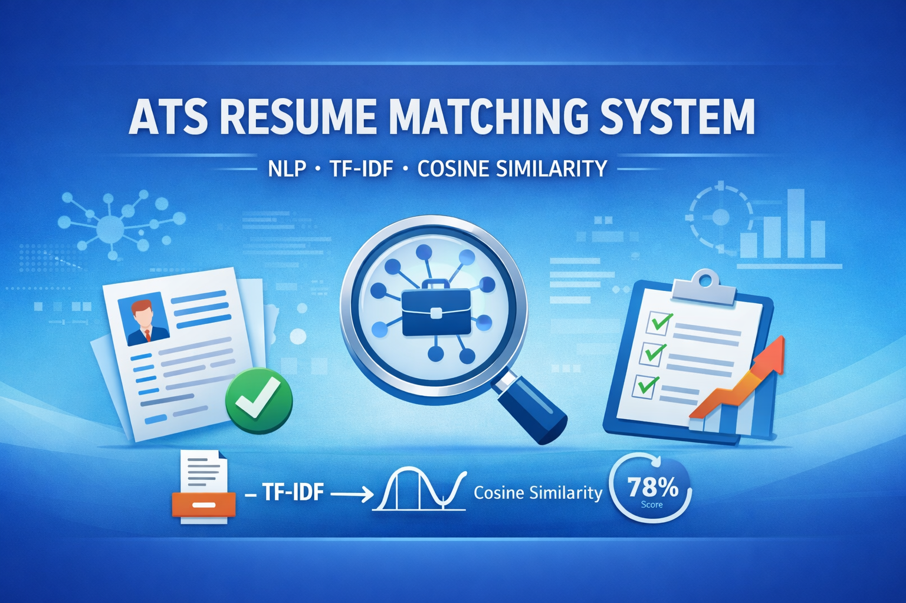
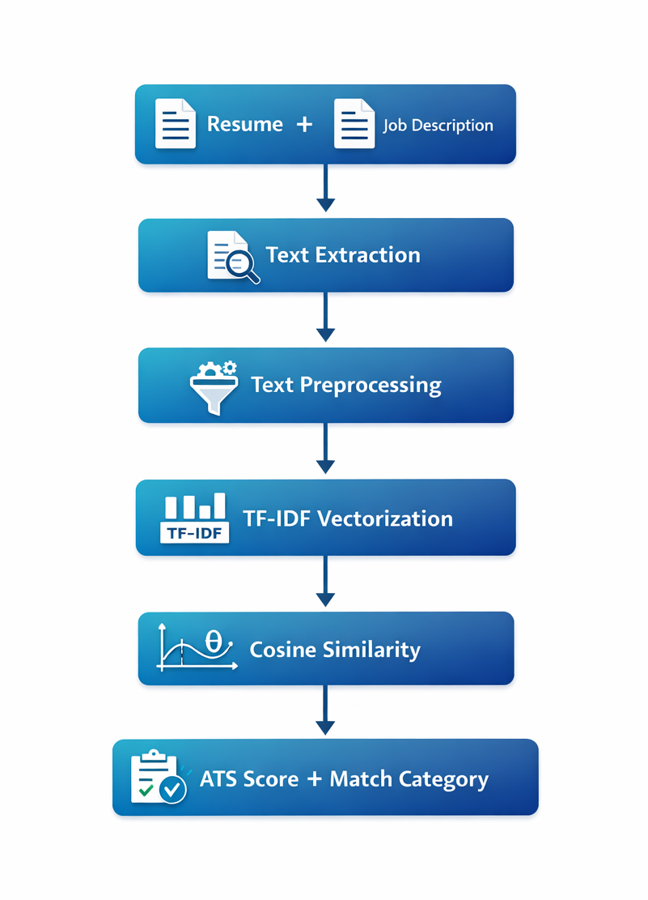

# 🚀 Match My Resume (R + NLP)
<p align="center">
  
</p>
## 🧠 Project Overview

This project implements a core Applicant Tracking System (ATS) simulator using Natural Language Processing in R.

The system evaluates how well a resume matches a given job description by:

- Extracting text from PDF/TXT files
- Cleaning and preprocessing textual data
- Converting text into numerical vectors using TF-IDF
- Calculating similarity using Cosine Similarity
- Generating an ATS match score (%)
- Providing keyword improvement suggestions

This project simulates how modern ATS platforms automatically screen resumes.

---

## 🏗 System Architecture



Pipeline Flow:

Resume + Job Description  
↓  
Text Extraction  
↓  
Text Preprocessing  
↓  
TF-IDF Vectorization  
↓  
Cosine Similarity  
↓  
ATS Score + Match Category  
↓  
Missing Keyword Suggestions  

---

## ⚙️ Features

✔ Interactive file selection (PDF / TXT support)  
✔ File format validation  
✔ Text normalization & preprocessing  
✔ TF-IDF based feature engineering  
✔ Cosine similarity score calculation  
✔ Match categorization (Strong / Moderate / Weak / Poor)  
✔ Resume improvement keyword suggestions  

---

## 🔬 Methodology

### 1️⃣ Input Handling
- Resume (PDF only)
- JD (PDF or TXT)
- Validation using file extensions
- Error handling using stop()

### 2️⃣ Text Preprocessing
- Lowercasing
- Special character removal
- Stopword removal
- Whitespace normalization

### 3️⃣ Feature Engineering (TF-IDF)
TF-IDF assigns higher weight to important and rare keywords while reducing weight of common terms.

### 4️⃣ Similarity Computation

Cosine Similarity Formula:

Cosine Similarity = (A · B) / (||A|| × ||B||)

Where:
- A = Job Description vector
- B = Resume vector

---

## 📊 Sample Output

```
============================
        ATS RESULT
============================
Match Category: Moderate Match
Match Score: 72.35 %
============================

Suggested Keywords:
- Docker
- Microservices
- CI/CD
```

---

## 🛠 Technologies Used

- R Programming
- pdftools
- tm
- text2vec
- stringr

Core Techniques:
- Natural Language Processing (NLP)
- TF-IDF Vectorization
- Cosine Similarity
- Keyword-based Suggestion Logic

---

## 🎯 Use Cases

- Resume optimization
- Career preparation
- ATS system simulation
- NLP-based similarity modeling

---

## ⚠️ Limitations

- Keyword-based matching (no semantic embeddings)
- Does not detect synonyms (e.g., "ML" vs "Machine Learning")
- Limited to document-level similarity

---

## 🚀 Future Enhancements

- Word embeddings (Word2Vec / BERT)
- Synonym expansion logic
- Multi-resume ranking
- Shiny Web Application interface
- Advanced skill prioritization

---

## 👨‍💻 Author

Developed using R and NLP techniques.

Open to feedback, improvements, and collaboration.
